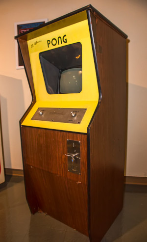
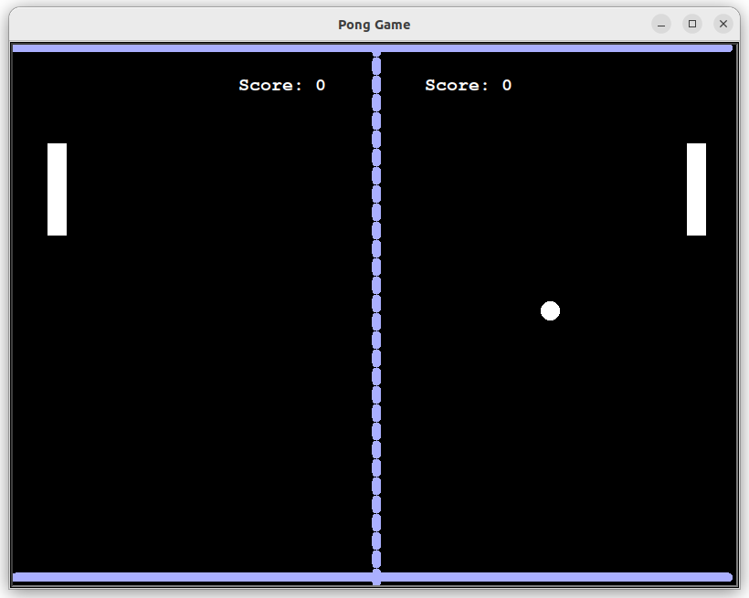
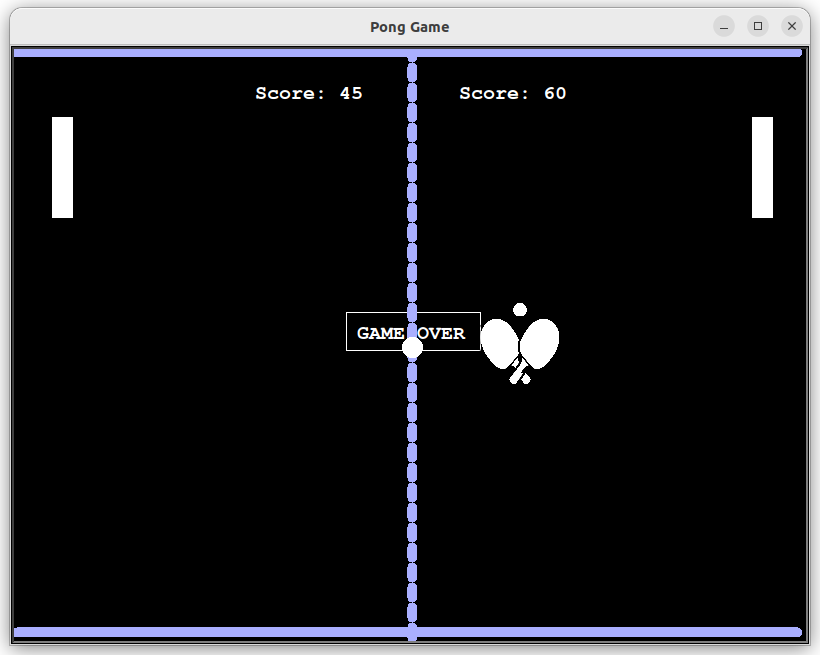

## Pong Game

OOP version [Pong](https://en.wikipedia.org/wiki/Pong) Game written in Python using the turtle library. 
       
Pong is a table tennis–themed twitch arcade sports video game, featuring simple two-dimensional graphics, manufactured by Atari and originally released in 1972.           




Try to play **Pong Game** on [ponggame.org](https://www.ponggame.org/)


###### It's a part of the **#100DaysOfCode** challenge by *Angela Yu*. ######    


#### Prerequisites
You will need the following software to run the Pong Game:
 - [Python 3](https://www.python.org/downloads/)

#### Installation
To get started with the **Pong Game**, follow these steps:

1. **Clone** the repository:

```sh
git clone https://github.com/resole79/pong_game.git
```

2. **Run** the **main.py** file:

```sh
python main.py
```

#### File Structure   
 - **main.py**: Main program.
 - **paddle.py**: Paddle class
	- Method: move_paddle, paddle_up, paddle_down
 - **ball.py**: Ball class
	- *Instance*: x_position, y_position, ball_speed
	- *Method*: move_ball, collision_wall, collision_paddle, refresh_ball
 - **scoreboard.py**: Scoreboard class
	- *Instance*:score_my, score_pc
	- *Method*:game_over, increase_score1, increase_score2, increase_score2, refresh_score
 - **display.py**: MyWindow class
	- Instance*: window_list, this_window, x_coord, y_coord
	- *Method*: create_window
 - **bord.py**: BordGame class
	- *Method*: create_bord

#### **Usage**

Press keys to move the paddles:
 - Left Paddle (my_paddle): 	
   - "a" to move up
   - "d" to move down
 - Right Paddle (pc_paddle): 	
   - "Left" to move up
   - "Right" to move down       
 

       




## **Credit**

Author : Emilio Reforgiato (resole79)

##
<p align="right"><a href="https://www.linkedin.com/in/emilio-reforgiato/" target=”_blank” ></a></p>


